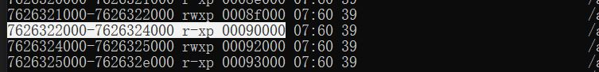

# Kernel-Trace
一个基于uprobe，能同时hook大量用户地址空间函数的kpm内核模块

# 如何使用
在成功加载本项目的kpm模块后，可通过 **dmesg | grep +Test-Log+** 命令查看模块日志，再使用项目user目录下的uprobe_trace_user.h文件提供的用户层接口进行编程即可。trace的输出结果在tracefs文件系统下，可通过 **mount | grep tracefs** 命令查看tracefs所在位置，一般都是在/sys/kernel/tracing，通过 **echo "1" >> /sys/kernel/tracing/tracing_on** 开启日志后通过 **cat /sys/kernel/tracing/trace_pipe | grep +Test-Log+** 查看trace的结果。

**set_module_base**函数用于设置要hook so的基址(打印函数偏移需要用到)。

**set_target_uid**函数用于设置要hook的app的uid(过滤输出需要)。

**set_target_file**函数用于设置要hook so的路径(必须是完整路径)。

**set_fun_info**函数第一个参数是要设置函数的uprobe偏移，计算方法见文末，第二个参数为函数偏移，第三个参数为自定义函数名。

**clear_all_uprobes**函数用于清除所有的uprobe挂载点。

上述函数的返回结果有SET_TRACE_SUCCESS、SET_TRACE_ERROR两种，分别表示设置成功和失败。

# 使用示例
编程思路可以参考[示例](https://github.com/AndroidReverser-Test/Il2cppTraceModule/blob/main/app/src/main/cpp/il2cpp_trace.cpp)

# 支持的内核版本
目前只在5.10以及5.15两个版本通过测试，理论上5.10以上版本都能正常使用。

# 一些疑惑
~~在内核使用uprobe_register函数注册uprobe挂载点的时候在一些特殊情况下会出现实际注册的函数偏移与传入的函数偏移不一致的问题，至于为什么会这样， 我翻阅linux内核源码发现问题出现于内存地址计算错误,从这里开始内存地址就出现了偏差，我推测是内存页计算有偏差，但是具体原因不清楚。~~
答案已经找到了，原来是我一开始就理解错了，传递给uprobe_register函数的偏移值压根就不是函数的文件偏移，而是要经过其他运算得到，简单来说就是函数地址减去所在内存段的基地址再加上该内存段内存区域的偏移量所得的值。
计算示例如下：
以下图片展示了一个so文件在maps文件中的区域段

假如一个函数的地址为0x7626323000,那要hook这个函数那传给uprobe_register函数的偏移值应该为0x7626323000-0x7626322000+0x90000=0x91000.
